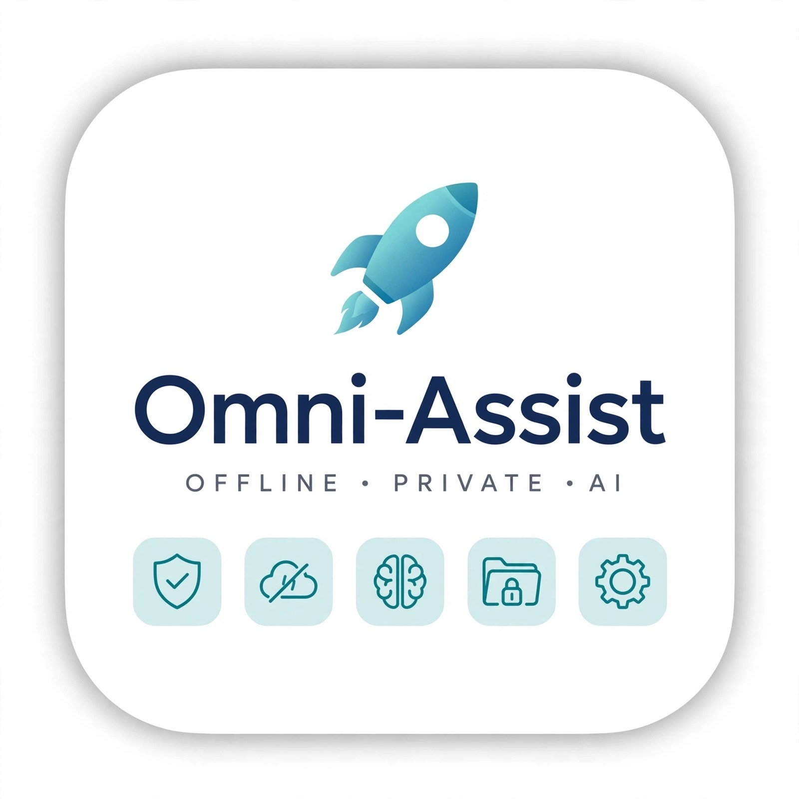

# 🚀 Omni-Assist - Offline • Private • AI

> A Secure, Private, and Fully Offline AI Assistant for Everyday Needs.

[](https://omni-assist.vercel.app)
[](#)
[](#)
[](#)

## 📸 Live Preview



*Dual-Engine Architecture: Ollama for Desktop + WebLLM for Web - No Data Leaves Your Device*

---

### 💡 What is Omni-Assist?

Omni-Assist is an evolution of **Bank AI Desktop** into a comprehensive, multi-domain assistant. It is built with **Tauri + React + Ollama** to run entirely offline.

**The Problem:**
- Mainstream AI tools require constant internet and risk data privacy.
- Sensitive domains like Banking, Health, and Study require complete confidentiality.
- Low-connectivity areas need AI that works without internet.

**The Solution:**
- ✅ **100% Offline:** Runs on local Ollama or in-browser WebLLM
- ✅ **100% Private:** Zero API calls, zero cloud storage
- ✅ **5 Domains in 1 App:** One assistant for everything

### 🧠 5 Domains Supported

| Domain | Focus Area |
| :--- | :--- |
| **💬 General** | Daily assistance, Q&A, productivity |
| **🏦 Banking** | UPI, loans, savings, investment & fraud awareness |
| **📚 Study** | Academic tutor for Science, Math, and more |
| **💻 Coding** | Senior-level developer for clean code & debugging |
| **🩺 Health** | General wellness information (Educational only) |

### ⚡ Dual-Engine Architecture

The app intelligently detects its environment and switches engines automatically.

**1. Desktop Mode (Tauri) - `Ollama`**
- Connects to `http://localhost:11434`
- Model: `phi3:mini` / `llama3.2` - High performance
- Ideal for native desktop experience

**2. Web Mode (Vercel) - `WebLLM`**
- Uses `@mlc-ai/web-llm` - `Llama-3.2-1B` runs inside the browser
- One-time model download (~1GB), then fully offline
- Ideal for live demo and instant access

```javascript
// Engine auto-detection in App.jsx
try {
  await fetch("http://localhost:11434/api/tags")
  setEngine("ollama") // Running in Desktop
} catch {
  setEngine("webllm") // Running on Web
}
### 🛠️ Tech Stack

- *Frontend:* React, Vite, Tailwind CSS
- *Desktop Framework:* Tauri (Rust)
- *AI - Desktop:* Ollama
- *AI - Web:* WebLLM (MLC)
- *Deployment:* Vercel

### 🚀 How to Run Locally

*1. Install Ollama*
Download from [ollama.com](https://ollama.com) and run:
ollama run phi3:mini
*2. Run Frontend*
npm install
npm run dev
Open `http://localhost:5173`

*3. Run as Desktop App*
npm run tauri dev
# Build executable
npm run tauri build
### 🔒 Privacy First

- No OpenAI API Key required
- No data is sent to any cloud service
- All chat history is stored in local storage
- Fully functional in airplane mode

### 👨‍💻 Author

*Radheshyam Dhangar*
- GitHub: [@radheshyamdhangar](https://github.com/radheshyamdhangar)
- Project: Omni-Assist

### 📜 License

MIT License
