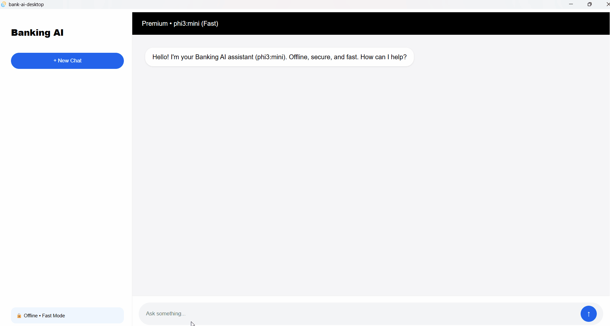

# Omni-Assist 🚀 - One AI for Everything

> Your Private, 100% Offline & Unlimited AI Assistant. No API Key. No Tracking. No Limits.

**Omni-Assist** is not just another chatbot. It's your personal **Sathi** that works for every domain - from Banking to Coding, without ever needing the internet.


### 🔴 Live Demo
**Web Version:** `https://omni-assist.vercel.app` (coming soon)
**Desktop Version:** Download from Releases



### ✨ Why Omni-Assist?

| Old Banking Assistant | New Omni-Assist |
| :--- | :--- |
| Only Banking | Banking, Study, Health, Coding, General |
| One Use Case | One AI for Everything |

### 🎯 Domains Covered

- 🏦 **Banking & Finance:** UPI, loans, fraud detection, financial advice
- 📚 **Study Sathi:** Homework help, exam prep, concepts in Hinglish
- 💻 **Code Buddy:** Write, debug & explain code in any language
- 🩺 **Health Guide:** General wellness & diet info (Not a medical diagnosis)
- 💬 **General Chat:** Your daily ChatGPT alternative, offline

### 🔒 Core Features

- **100% Offline:** Runs on Ollama `llama3.2:1b` - your data never leaves your device.
- **Unlimited Free:** No daily limits like ChatGPT/Gemini.
- **Privacy First:** Zero data collection. We don't even have a database.
- **Super Lightweight:** Built with Tauri (Rust) - < 15MB app vs 200MB Electron apps.
- **Cross Platform:** Works on Desktop (Windows/Mac/Linux) & Web (via WebLLM)

### 🛠️ Tech Stack

- **Frontend:** React + Vite
- **Desktop:** Tauri (Rust)
- **AI Engine:** Ollama + WebLLM (for web version)
- **Deployment:** Vercel (Web) + GitHub Releases (Desktop)

### 🚀 Quick Start (Web Version)

```bash
git clone https://github.com/radheshyamdhangar/omni-assist.git
cd omni-assist
npm install
npm run dev